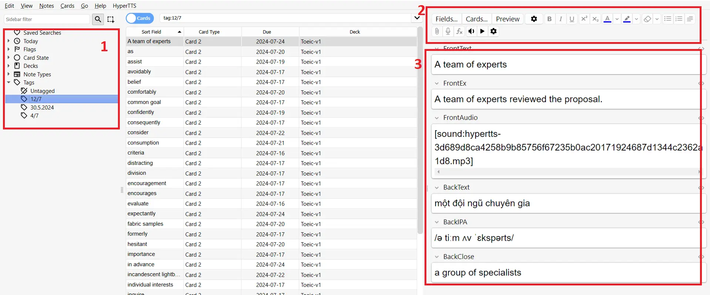
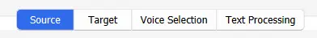
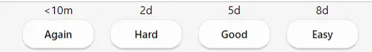

## Chuẩn bị

- Đầu tiên các bạn tải anki về: [Tại đây](https://github.com/ankitects/anki/releases/download/24.06.3/anki-24.06.3-windows-qt5.exe)
- Tải template mình đã làm sẵn: [Tại đây](https://drive.google.com/file/d/11Uijm9h3Rb4vww-4xkvCUYTuSX92MjpX/view?usp=drive_link).
- Người chưa từng dùng anki nên xem trước video này: [Anki cơ bản](https://www.youtube.com/watch?v=M9-qwsHyBrc) . Chỉ cần xem lướt để hiểu sơ cách dùng.

## Import template vào anki

Sau khi đã tải file anki và template -> cài đặt anki -> nhấn đúp mở file template ( Template.apkg ). Anki sẽ hiện lên một cửa sổ thông báo import, bạn chỉ cần nhấn vào nút import, không cần quan tâm cái khác.

## Tạo bảng từ vựng bằng chatgpt

Để tối ưu thời gian làm card anki thì mình sẽ dùng anki để tạo bảng từ vựng. Template của mình hiện tại dùng 6 cột gồm:
- FrontText ( từ vựng )
- FrontEx ( Câu ví dụ )
- FrontAudio ( File âm thanh )
- BackText ( Nghĩa của từ tiếng anh )
- BackIpa ( Phiên âm IPA )
- BackClose ( Từ đồng nghĩa )

Trong đó cột FrontAudio thì bước này chưa cần quan tâm, các bạn chỉ cần nhờ chatgpt tạo 5 cột còn lại thôi. 

Các bạn tạo một chat mới -> gõ câu lệnh vào, các bạn có thể lấy lệnh của mình hoặc tự gõ theo thu cầu của bản thân 

	Từ bây giờ bạn là trợ lý từ vựng của tôi. Mỗi khi tôi gửi bạn 1 từ / cụm từ/ list các từ thì bạn hãy trả về cho tôi một bảng gồm 5 cột như sau: Từ/Cụm từ; Phiên âm; 	Nghĩa;	Ví dụ;	Từ đồng nghĩa. Nếu bạn hiểu thì trả lời oke.

Từ bây giờ bạn chỉ cần đưa vô 1 list từ vựng là nó sẽ cho bạn một bảng từ vựng 5 cột, bạn chỉ cần dán vô google sheet -> tải về dưới dạng file là **csv**

## Import từ vựng vào anki

1. Mở anki lên, vào phần file -> import

2. Chọn file từ vựng csv 
3. Chỉnh lại các thông số như sau

	- **File** -> Field separator : Chọn Comma
	- **Import options** :
		- Notetype: Toeic-1  ( đây là tên template của mình )
		- Deck: Chọn bộ thẻ từ vựng, mặc định ban đầu sẽ là bộ Toeic-v1, bạn có thể đổi tên tùy ý
		- Tag all notes: Mỗi lần thêm từ vựng thì đặt 1 tag vào cho dễ quản lý việc thêm audio. Ví dụ đặt tên là 17/7-v1 chẳng hạn
	- **Field mapping**: Chọn đúng dữ liệu từng fields, ý nghĩa từng field xem ở mục  [Tạo bảng từ vựng bằng chatgpt](#tạo-bảng-từ-vựng-bằng-chatgpt)

## Thêm âm thanh vào card anki

**Bước 1:** Để thêm âm thanh vào thì bạn cần cài thêm 1 extension cho anki là HyperTTS.
Vào Tools -> Add ons -> Get addons -> Điền id 111623432 

> Sau khi cài thêm extension thành công thì tắt rồi khởi động lại anki.
{: .prompt-warning }

**Bước 2:** Vào tools -> HyperTTS services configuration  -> Free trial -> Điền email cá nhân vào

> Mỗi email sẽ cho dùng 5000 kí tự, mỗi khi hết nó sẽ báo error và không thêm được âm thanh. Các bạn chỉ cần quay lại phần  HyperTTS services configuration và chọn Remove API Key, sau đó nhập đại một mail nào đó miễn là nó có tồn tại là được cấp lại 5000 kí tự.
{: .prompt-tip }

> Bước này cũng cần tắt khởi động lại anki để nó đồng bộ dữ liệu.
{: .prompt-warning }

**Bước 3** Vào Browse -> Lướt thanh nav bên tay trái, chọn tag từ vựng mà bạn đã tạo ( Ở ô số 1 ) -> Xong chọn tất cả từ vựng của tag đó ( chọn bất kì một từ rồi bấm ctrl + A ) -> Chọn HyperTTS ở thanh công cụ -> Add audio collection 

Bạn cần chú ý chỉnh 4 phần này:
- Source:
	- Source Field: FrontText
- Target:
	- Target Field: FrontAudio
- Voice Selection:
	- Voice Filters: Các bạn lựa chọn ngôn ngữ, giới tính ,.... của giọng đọc theo ý thích.
	- Voice: Phần này là phần chọn giọng, bạn hãy chọn bất kỳ một từ vựng ở bảng bên tay phải thì phần voice sẽ hiện nút **Play Audio Sample**, bạn có thể bấm vào để tìm giọng đọc vừa ý

Sau khi chỉnh xong -> Save ( ở trên góc bên trái ) -> Apply to Notes ( Góc dưới bên phải )

> Chỉ làm một lần duy nhất, từ lần sau không cần phải setting nữa. Và nhớ tắt rồi mở lại anki sau bước này để anki đồng bộ dữ liệu.
{: .prompt-warning }

Từ những lần sau, bạn muốn thêm audio cho list từ vựng mới thì chỉ cần lặp lại những bước này, tuy nhiên ở bước 3 Chọn HyperTTS ở thanh công cụ -> Add audio collection: Preset 1 ( đây chính là setting bạn lưu ở bước trên )

## Cách học anki

Khi học từ vựng, mỗi khi bấm Show Answer thì anki sẽ hiện 4 nút này. 
- Again: Từ quá khó, bạn không biết gì
- Hard: Từ vẫn khó, nhưng nhớ mang máng
- Good: Nhớ cách ghi và nhớ nghĩa, nhưng tốn thời gian suy nghĩ khá lâu
- Easy: Nhớ cách ghi và nghĩa trong vòng vài giây

